# 电子标签多条码识别系统设计文档

## 一、系统愿景与目标

### 1.1 业务目标

构建一个高性能的电子标签识别系统,能够自动识别图像中的多个条码和相关文字信息,并按视觉阅读顺序智能输出结构化结果。系统旨在解决人工录入效率低、出错率高的问题,提升电子标签数据采集的自动化水平。

### 1.2 核心价值主张

- **多模态识别能力**: 同时处理条码和文字信息,建立关联关系
- **智能排序输出**: 模拟人类阅读习惯,按从上到下、从左到右的顺序组织结果
- **灵活处理模式**: 根据不同场景需求,在速度与准确率之间平衡
- **混合部署能力**: 支持本地离线处理和云端增强两种模式

### 1.3 成功度量标准

| 指标类型 | 目标值 | 说明 |
|---------|--------|------|
| 条码识别准确率 | ≥ 99% | 标准光照和角度下 |
| 文字识别准确率 | ≥ 95% | 清晰图像场景 |
| 排序正确率 | ≥ 98% | 按阅读顺序输出 |
| 极速模式响应时间 | < 30ms | 仅条码识别 |
| 均衡模式响应时间 | < 150ms | 条码+关键文字 |
| 完整模式响应时间 | < 500ms | 条码+全文字 |
| 批量处理效率 | 100张/15秒 | 均衡模式下 |

## 二、系统架构设计

### 2.1 整体架构视图

系统采用前后端分离的Web服务架构,支持本地部署和云端增强两种运行模式。

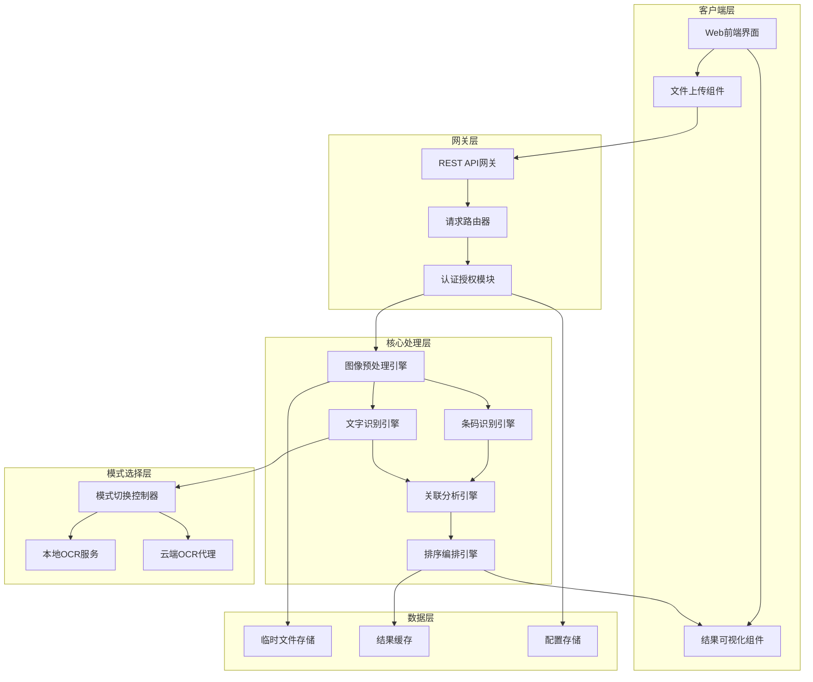

### 2.2 架构分层职责

| 层级 | 职责 | 关键决策依据 |
|------|------|------------|
| 客户端层 | 用户交互、结果展示、可视化标注 | 满足用户可视化界面需求 |
| 网关层 | API路由、请求验证、负载控制 | Web服务标准架构模式 |
| 核心处理层 | 图像识别、数据解析、逻辑编排 | 核心业务能力封装 |
| 模式选择层 | 本地/云端切换、OCR服务代理 | 支持混合部署要求 |
| 数据层 | 临时存储、结果缓存、配置管理 | 性能优化与状态管理 |

### 2.3 部署架构

系统支持两种部署模式,通过配置参数动态切换:

**模式一:本地离线部署**
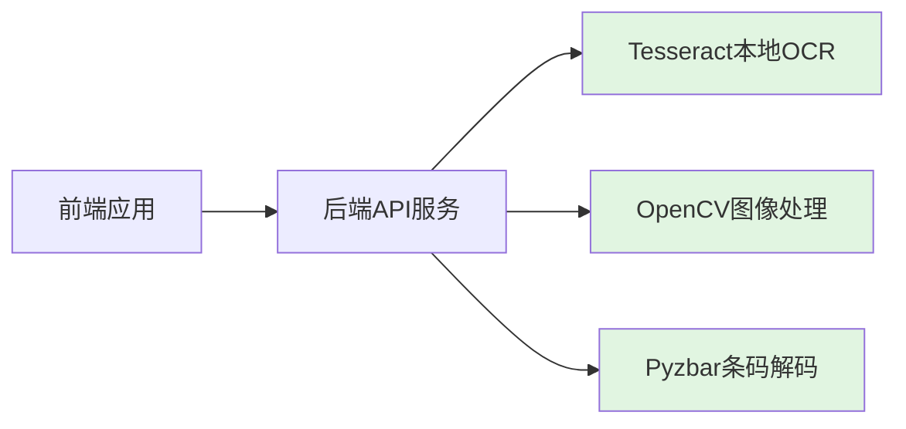

**模式二:云端增强部署**
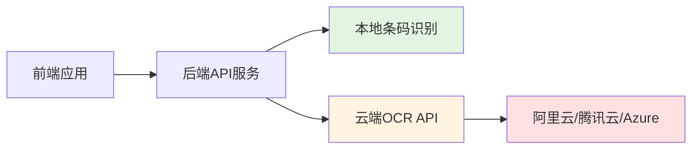

## 三、核心功能域设计

### 3.1 图像预处理引擎

**设计意图**: 标准化输入图像质量,提升后续识别准确率

**处理流程**:
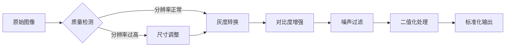

**关键策略**:

| 处理环节 | 策略 | 目的 |
|---------|------|------|
| 尺寸控制 | 限制最大分辨率为2000x2000像素 | 平衡识别效果与处理速度 |
| 灰度转换 | 使用加权RGB转换 | 保留关键视觉特征 |
| 对比度增强 | 自适应直方图均衡化 | 应对不同光照条件 |
| 噪声过滤 | 中值滤波 | 去除扫描噪点 |
| 二值化 | 自适应阈值分割 | 增强边缘特征 |

### 3.2 条码识别引擎

**设计意图**: 快速准确地识别图像中的所有条码,提取数据和位置信息

**支持的条码类型**:
- 一维条码: CODE128, CODE39, EAN13, EAN8, UPC-A, UPC-E
- 二维条码: QR Code, Data Matrix, PDF417

**识别策略**:

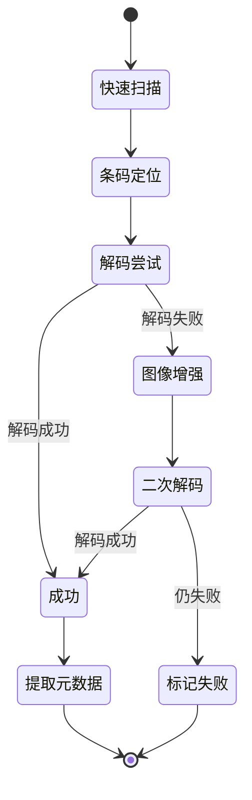

**输出数据结构**:

| 字段 | 类型 | 说明 |
|-----|------|------|
| barcode_data | 字符串 | 条码内容 |
| barcode_type | 枚举 | 条码格式类型 |
| position | 坐标对象 | 边界框坐标(x,y,width,height) |
| confidence | 浮点数 | 识别置信度(0-1) |
| decode_time | 整数 | 解码耗时(毫秒) |

### 3.3 文字识别引擎

**设计意图**: 识别标签上的文字信息,并解析结构化字段

**双模式运行机制**:

| 模式 | 实现方式 | 适用场景 | 优势 | 劣势 |
|------|---------|---------|------|------|
| 本地模式 | Tesseract OCR | 离线环境、敏感数据 | 无网络依赖、数据安全 | 准确率受限 |
| 云端模式 | 云服务API | 联网环境、高准确率需求 | 准确率高、多语言支持好 | 需要网络、有调用成本 |

**识别流程**:

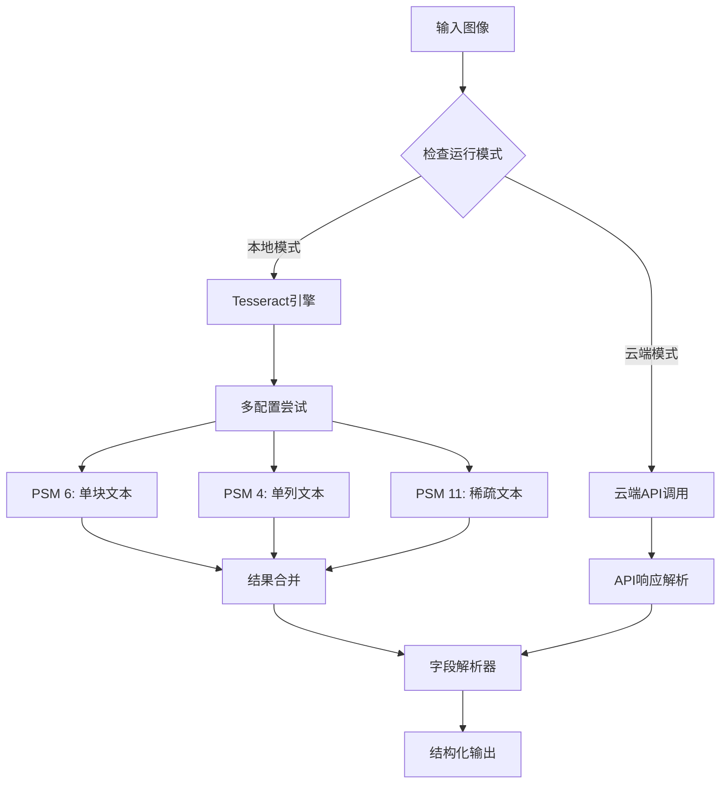

**字段解析规则**:

系统能够识别并提取以下结构化字段:

| 字段标识 | 模式匹配规则 | 示例 |
|---------|------------|------|
| P/N (料号) | "P/N:" 或 "Part Number:" 后的字母数字串 | P/N: ABC123-456 |
| QUANTITY (数量) | "QTY:" 或 "Quantity:" 后的数字 | QTY: 500 |
| DATE (日期) | YYYY-MM-DD 或 DD/MM/YYYY 格式 | 2024-01-15 |
| LOT (批次号) | "LOT:" 或 "Batch:" 后的字符串 | LOT: 20240115-A |
| 自由文本 | 不匹配上述模式的其他文字 | - |

### 3.4 关联分析引擎

**设计意图**: 建立条码与周围文字的语义关联,理解标签的信息结构

**关联策略**:

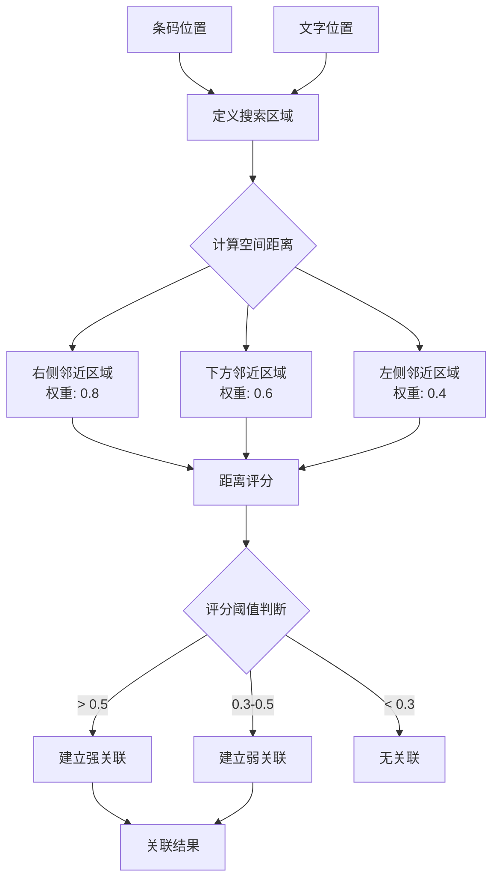

**关联距离计算**:

距离评分 = 1 - (实际距离 / 最大搜索半径) × 方向权重

其中:
- 最大搜索半径: 条码宽度的2倍
- 方向权重: 根据阅读习惯设定(右侧 > 下方 > 左侧)

**输出关联模型**:

| 关联类型 | 描述 | 输出格式 |
|---------|------|---------|
| 条码-文字关联 | 条码与其标识的信息 | {barcode: "...", related_text: [...], relation_type: "strong"} |
| 独立文字 | 无条码关联的标签信息 | {text: "...", position: {...}, type: "independent"} |
| 混合组 | 一个条码对应多个字段 | {barcode: "...", fields: {P/N: "...", QTY: "..."}} |

### 3.5 智能排序引擎

**设计意图**: 按人类阅读习惯输出识别结果,而非随机顺序

**排序策略对比**:

| 策略名称 | 排序规则 | 适用场景 | 复杂度 |
|---------|---------|---------|--------|
| 从上到下 | 仅按Y坐标升序 | 垂直排列的标签 | O(n log n) |
| 从左到右 | 仅按X坐标升序 | 水平排列的标签 | O(n log n) |
| 阅读顺序 | 先按行分组,行内从左到右 | 通用场景(默认) | O(n log n) |
| 网格顺序 | 按行列矩阵位置 | 整齐排列的多标签 | O(n) |

**阅读顺序算法流程**:

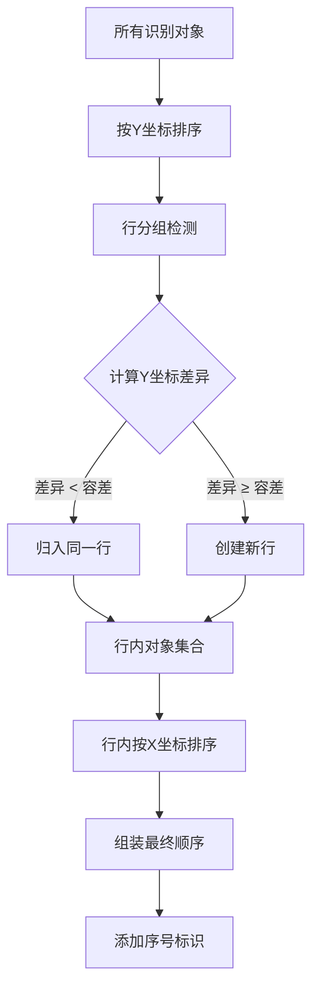

**容差参数设计**:

| 参数 | 默认值 | 说明 | 可调范围 |
|-----|-------|------|---------|
| 行容差 | 30像素 | 判断是否同一行的Y坐标差异阈值 | 10-100像素 |
| 列容差 | 20像素 | 判断是否同一列的X坐标差异阈值 | 10-80像素 |
| 最小对象间距 | 15像素 | 两个对象最小间距,低于此值视为重叠 | 5-50像素 |

## 四、处理模式设计

### 4.1 模式分类

系统提供三种处理模式,满足不同场景的性能需求:

| 模式 | 处理内容 | 目标性能 | 适用场景 |
|------|---------|---------|---------|
| 极速模式 | 仅条码识别 | < 30ms/图 | 生产线实时扫描,仅需条码数据 |
| 均衡模式 | 条码 + 关键字段文字 | < 150ms/图 | 常规标签录入,需要料号等关键信息 |
| 完整模式 | 条码 + 全部文字 + 关联分析 | < 500ms/图 | 档案归档,需要完整信息采集 |

### 4.2 模式决策流程

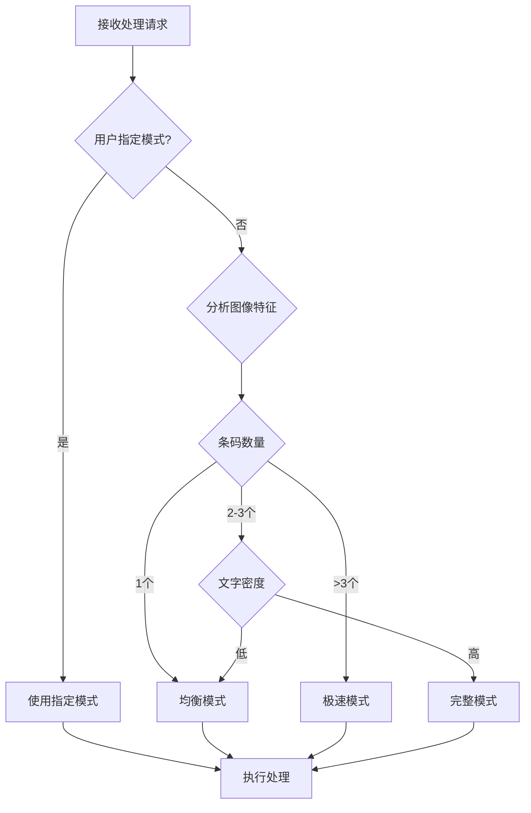

### 4.3 模式处理差异

**极速模式**:
- 跳过图像预处理的对比度增强步骤
- 仅执行条码识别,不启动OCR引擎
- 不进行关联分析
- 简单的Y坐标排序

**均衡模式**:
- 标准预处理流程
- 条码识别 + 结构化字段OCR(仅识别P/N, QTY等关键标识周围文字)
- 简单关联分析
- 阅读顺序排序

**完整模式**:
- 完整预处理流程
- 条码识别 + 全图OCR
- 深度关联分析
- 阅读顺序排序 + 关联关系标注

## 五、API接口设计

### 5.1 RESTful API规范

**基础路径**: `/api/v1`

**通用响应格式**:

| 字段 | 类型 | 说明 |
|-----|------|------|
| success | 布尔值 | 请求是否成功 |
| data | 对象/数组 | 返回的数据内容 |
| message | 字符串 | 描述信息或错误提示 |
| timestamp | 时间戳 | 响应时间 |
| request_id | 字符串 | 请求追踪ID |

### 5.2 核心接口定义

**接口1: 单图处理**

```
POST /api/v1/process/single
```

**请求参数**:

| 参数 | 类型 | 必填 | 说明 |
|-----|------|------|------|
| image | 文件 | 是 | 图像文件(支持jpg/png/bmp) |
| mode | 字符串 | 否 | 处理模式: fast/balanced/full,默认balanced |
| sort_order | 字符串 | 否 | 排序方式: reading_order/top_to_bottom/left_to_right |
| ocr_mode | 字符串 | 否 | OCR模式: local/cloud,默认local |
| return_image | 布尔值 | 否 | 是否返回标注后的图像,默认false |

**响应数据结构**:

| 字段 | 类型 | 说明 |
|-----|------|------|
| process_time | 整数 | 处理耗时(毫秒) |
| mode_used | 字符串 | 实际使用的处理模式 |
| results | 数组 | 识别结果列表 |
| results[].order | 整数 | 排序序号 |
| results[].type | 字符串 | 类型: barcode/text/group |
| results[].data | 对象 | 具体数据内容 |
| results[].position | 对象 | 位置坐标 |
| annotated_image | 字符串 | Base64编码的标注图像(如requested) |

---

**接口2: 批量处理**

```
POST /api/v1/process/batch
```

**请求参数**:

| 参数 | 类型 | 必填 | 说明 |
|-----|------|------|------|
| images | 文件数组 | 是 | 多个图像文件 |
| mode | 字符串 | 否 | 统一处理模式 |
| sort_order | 字符串 | 否 | 统一排序方式 |
| max_concurrent | 整数 | 否 | 最大并发数,默认4 |
| callback_url | 字符串 | 否 | 完成后回调地址(异步模式) |

**响应数据结构**:

| 字段 | 类型 | 说明 |
|-----|------|------|
| batch_id | 字符串 | 批处理任务ID |
| total_images | 整数 | 总图像数 |
| results | 数组 | 各图像处理结果 |
| results[].image_name | 字符串 | 图像文件名 |
| results[].success | 布尔值 | 是否处理成功 |
| results[].data | 对象 | 识别结果(同单图接口) |
| total_time | 整数 | 总耗时(毫秒) |

---

**接口3: 配置管理**

```
GET/PUT /api/v1/config
```

**可配置项**:

| 配置项 | 类型 | 默认值 | 说明 |
|-------|------|-------|------|
| default_mode | 字符串 | balanced | 默认处理模式 |
| default_ocr_mode | 字符串 | local | 默认OCR模式 |
| max_image_size | 整数 | 2000 | 最大图像尺寸(像素) |
| position_tolerance | 整数 | 30 | 排序容差(像素) |
| cloud_ocr_provider | 字符串 | none | 云端OCR提供商 |
| cloud_ocr_key | 字符串 | - | 云端API密钥 |
| enable_cache | 布尔值 | true | 是否启用结果缓存 |
| cache_ttl | 整数 | 3600 | 缓存有效期(秒) |

---

**接口4: 健康检查**

```
GET /api/v1/health
```

**响应数据**:

| 字段 | 类型 | 说明 |
|-----|------|------|
| status | 字符串 | 服务状态: healthy/degraded/unhealthy |
| components | 对象 | 各组件状态 |
| components.barcode_engine | 字符串 | 条码引擎状态 |
| components.ocr_local | 字符串 | 本地OCR状态 |
| components.ocr_cloud | 字符串 | 云端OCR状态 |
| version | 字符串 | 系统版本号 |

## 六、前端界面设计

### 6.1 功能页面结构

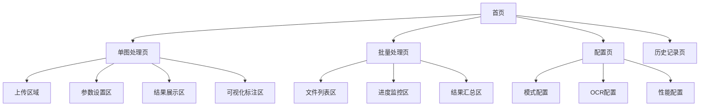

### 6.2 核心交互流程

**单图处理流程**:

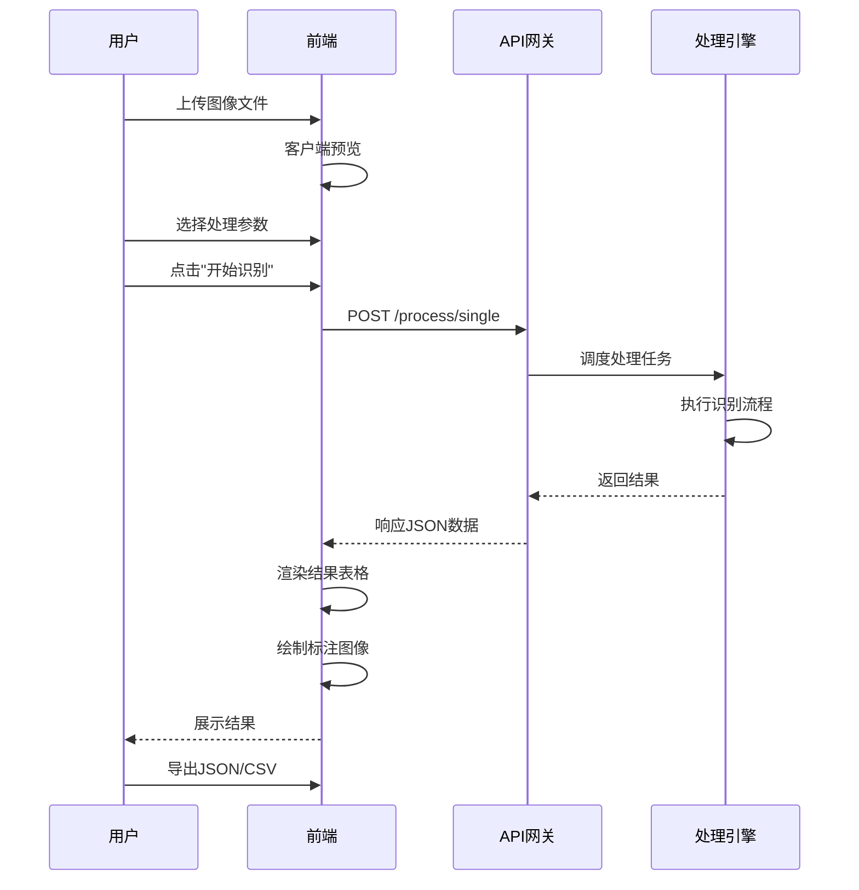

### 6.3 可视化标注规范

**标注元素设计**:

| 标注对象 | 视觉样式 | 标注内容 |
|---------|---------|---------|
| 条码 | 绿色矩形框(线宽2px) | 左上角显示序号,右上角显示类型 |
| 关联文字 | 蓝色矩形框(线宽1px) | 虚线连接至对应条码 |
| 独立文字 | 橙色矩形框(线宽1px) | 左上角显示序号 |
| 排序序号 | 白底红字圆形标签 | 数字序号 |
| 关联连线 | 蓝色虚线(线宽1px) | 箭头指向 |

**交互功能**:

- 鼠标悬停: 显示详细信息浮窗
- 点击选中: 高亮对应表格行
- 缩放拖动: 支持图像缩放和平移查看
- 下载标注图: 导出可视化结果图像

### 6.4 响应式设计要求

**视口适配**:

| 设备类型 | 屏幕宽度 | 布局调整 |
|---------|---------|---------|
| 桌面端 | ≥ 1200px | 左右分栏: 图像(60%) + 结果(40%) |
| 平板端 | 768-1199px | 上下分栏: 图像(上) + 结果(下) |
| 移动端 | < 768px | 标签页切换: 图像 / 结果 |

## 七、数据安全与隐私设计

### 7.1 本地模式安全策略

**数据隔离原则**:

- 所有图像处理在本地完成,不发送任何数据到外部服务器
- 临时文件存储在系统临时目录,处理完成后立即删除
- 结果缓存仅保留在内存中,服务重启后清空

**文件处理安全**:

| 安全措施 | 实施方式 | 防范风险 |
|---------|---------|---------|
| 文件类型验证 | 检查文件扩展名和MIME类型 | 防止恶意文件上传 |
| 文件大小限制 | 单文件不超过10MB | 防止资源耗尽攻击 |
| 临时文件命名 | 使用UUID随机命名 | 防止路径遍历攻击 |
| 定时清理 | 每小时清理超过1小时的临时文件 | 防止磁盘空间耗尽 |

### 7.2 云端模式安全策略

**数据传输安全**:

- 仅在用户明确授权后启用云端OCR
- 使用HTTPS加密传输图像数据
- 不在云端保留任何图像副本
- 支持配置可信的云服务提供商白名单

**敏感信息保护**:

| 保护对象 | 保护措施 |
|---------|---------|
| API密钥 | 加密存储,不在日志中记录 |
| 识别结果 | 不上传至云端,仅本地处理 |
| 用户配置 | 本地存储,不同步到云端 |

### 7.3 访问控制

**认证机制**:

- 基于Token的API认证
- Token有效期24小时,过期自动刷新
- 支持配置允许访问的IP地址白名单

**权限分级**:

| 角色 | 权限 |
|------|------|
| 访客 | 仅可使用单图处理,不可保存配置 |
| 普通用户 | 可使用所有处理功能,可保存个人配置 |
| 管理员 | 可修改系统级配置,可查看所有处理记录 |

## 八、性能优化策略

### 8.1 并发处理设计

**批量处理并发模型**:

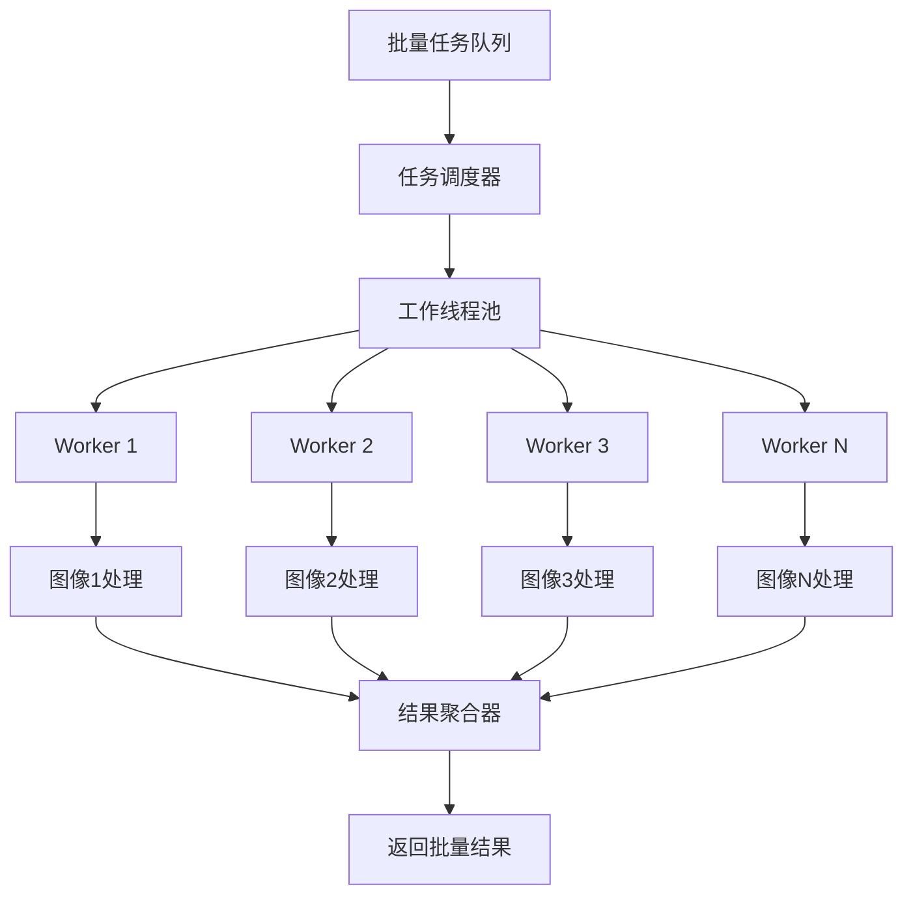

**并发控制参数**:

| 参数 | 默认值 | 说明 | 调整依据 |
|-----|-------|------|---------|
| 最大工作线程数 | 4 | 同时处理的图像数量 | CPU核心数 |
| 任务队列长度 | 100 | 等待处理的任务数上限 | 内存容量 |
| 超时时间 | 30秒 | 单个任务最大处理时间 | 图像复杂度 |

### 8.2 缓存策略

**多级缓存架构**:

| 缓存层级 | 缓存内容 | 有效期 | 淘汰策略 |
|---------|---------|-------|---------|
| L1: 内存缓存 | 图像预处理结果 | 10分钟 | LRU |
| L2: 结果缓存 | 完整识别结果 | 1小时 | LRU |
| L3: 配置缓存 | 系统配置参数 | 直到修改 | 不淘汰 |

**缓存键设计**:

缓存键 = MD5(图像内容) + 处理模式 + 排序方式 + OCR模式

### 8.3 资源管理

**内存管理策略**:

- 大图像分块处理,避免整图加载到内存
- 处理完成后立即释放图像对象
- 设置最大内存使用上限(默认1GB)

**GPU加速支持**(可选):

- 检测系统是否有可用GPU
- 对于批量处理场景,优先使用GPU加速图像预处理
- 降级机制:GPU不可用时自动切换到CPU处理

## 九、错误处理与容错设计

### 9.1 错误分类

| 错误类型 | HTTP状态码 | 错误代码 | 处理策略 |
|---------|-----------|---------|---------|
| 文件格式错误 | 400 | ERR_INVALID_FORMAT | 返回错误提示,要求重新上传 |
| 文件过大 | 413 | ERR_FILE_TOO_LARGE | 返回错误提示,说明大小限制 |
| 识别失败 | 200 | WARN_NO_RESULT | 返回空结果,附带建议 |
| OCR服务不可用 | 503 | ERR_OCR_UNAVAILABLE | 降级到本地模式 |
| 云端API超时 | 504 | ERR_CLOUD_TIMEOUT | 降级到本地模式 |
| 系统过载 | 503 | ERR_OVERLOAD | 拒绝请求,建议稍后重试 |

### 9.2 降级策略

**云端OCR降级流程**:

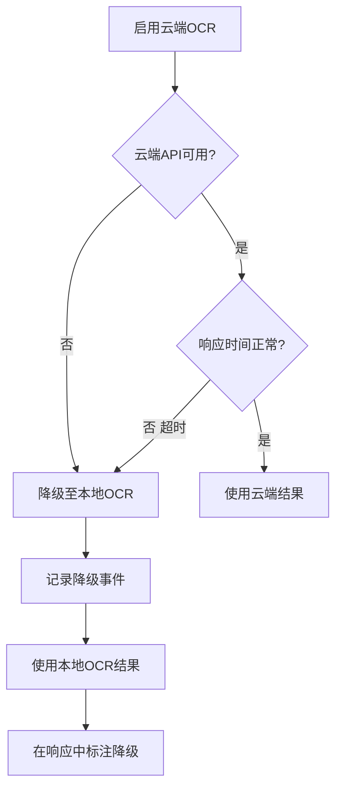

**处理模式降级**:

- 完整模式失败 → 尝试均衡模式
- 均衡模式失败 → 尝试极速模式
- 极速模式失败 → 返回错误,附带建议

### 9.3 容错机制

**部分失败处理**:

批量处理时,单个图像失败不影响其他图像:

- 记录失败图像信息
- 继续处理后续图像
- 在结果中标注失败项
- 返回成功与失败的统计信息

**重试机制**:

| 场景 | 重试次数 | 重试间隔 | 退避策略 |
|------|---------|---------|---------|
| 云端API调用失败 | 3次 | 1秒 | 指数退避(1s, 2s, 4s) |
| 临时文件写入失败 | 2次 | 0.5秒 | 固定间隔 |
| 条码解码失败 | 2次(含图像增强) | 无 | 立即重试 |

## 十、监控与日志设计

### 10.1 关键指标监控

**性能指标**:

| 指标名称 | 监控频率 | 告警阈值 | 说明 |
|---------|---------|---------|------|
| 平均响应时间 | 实时 | 均衡模式 > 200ms | 处理速度监控 |
| 请求成功率 | 每分钟 | < 95% | 系统稳定性 |
| 并发处理数 | 实时 | > 90%容量 | 负载监控 |
| 内存使用率 | 每30秒 | > 80% | 资源使用监控 |
| OCR云端调用次数 | 每小时 | 按配额设定 | 成本控制 |

**业务指标**:

| 指标名称 | 统计周期 | 用途 |
|---------|---------|------|
| 总处理图像数 | 每日 | 使用量统计 |
| 各模式使用占比 | 每日 | 优化模式配置 |
| 平均每图条码数 | 每日 | 了解使用场景 |
| 识别失败率 | 每日 | 质量监控 |
| 云端/本地OCR占比 | 每日 | 成本分析 |

### 10.2 日志策略

**日志级别**:

| 级别 | 记录内容 | 输出位置 |
|------|---------|---------|
| DEBUG | 详细的处理流程,参数值 | 仅开发环境 |
| INFO | 正常的业务操作,处理结果 | 文件 + 控制台 |
| WARN | 降级事件,部分失败 | 文件 |
| ERROR | 处理失败,异常错误 | 文件 + 告警系统 |

**日志内容规范**:

每条日志必须包含:
- 时间戳(ISO 8601格式)
- 请求ID(用于追踪)
- 日志级别
- 模块名称
- 操作描述
- 关键参数(脱敏后)
- 处理耗时(如适用)

**日志保留策略**:

- INFO及以上级别日志保留30天
- ERROR日志保留90天
- 单个日志文件不超过100MB
- 按日期和大小滚动

## 十一、部署与运维设计

### 11.1 部署方案

**标准部署架构**:

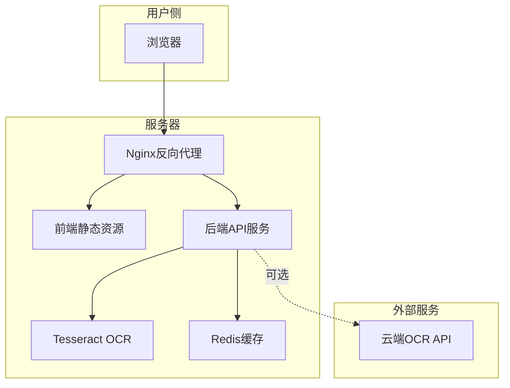

**环境要求**:

| 组件 | 最低要求 | 推荐配置 |
|------|---------|---------|
| 操作系统 | Linux/Windows Server | Ubuntu 20.04 LTS |
| CPU | 2核 | 4核或更高 |
| 内存 | 4GB | 8GB或更高 |
| 磁盘空间 | 10GB | 50GB SSD |
| Python版本 | 3.8+ | 3.10+ |
| Tesseract版本 | 4.0+ | 5.3+ |

### 11.2 容器化部署

**Docker镜像分层**:

| 层级 | 内容 | 大小估算 |
|------|------|---------|
| 基础层 | Ubuntu + Python | 150MB |
| 依赖层 | OpenCV + Tesseract + Python包 | 800MB |
| 应用层 | 系统代码 | 50MB |
| 配置层 | 默认配置文件 | 1MB |
| 总计 | - | ~1GB |

**Docker Compose配置要点**:

服务组成:
- 前端服务(Nginx)
- 后端服务(Python应用)
- 缓存服务(Redis)

网络配置:
- 前端和后端在同一内部网络
- 仅前端暴露到外部端口(默认8080)

卷挂载:
- 配置文件挂载为可修改卷
- 临时文件目录使用tmpfs(内存文件系统)

### 11.3 配置管理

**配置文件结构**:

| 配置文件 | 内容 | 修改频率 |
|---------|------|---------|
| system.yaml | 系统级参数(端口,路径等) | 部署时配置,很少修改 |
| processing.yaml | 处理参数(模式,阈值等) | 根据使用场景调整 |
| ocr.yaml | OCR相关配置(提供商,密钥等) | 启用云端服务时配置 |
| logging.yaml | 日志配置(级别,输出等) | 调试时调整 |

**环境变量支持**:

关键配置支持通过环境变量覆盖:

| 环境变量 | 对应配置 | 说明 |
|---------|---------|------|
| ELS_PORT | system.port | 服务端口 |
| ELS_OCR_MODE | processing.default_ocr_mode | 默认OCR模式 |
| ELS_CLOUD_PROVIDER | ocr.cloud_provider | 云端提供商 |
| ELS_CLOUD_KEY | ocr.cloud_key | 云端API密钥 |
| ELS_LOG_LEVEL | logging.level | 日志级别 |

### 11.4 升级与回滚

**版本管理策略**:

采用语义化版本号: 主版本.次版本.修订号

- 主版本: API不兼容的变更
- 次版本: 向后兼容的功能新增
- 修订号: 向后兼容的问题修复

**升级流程**:

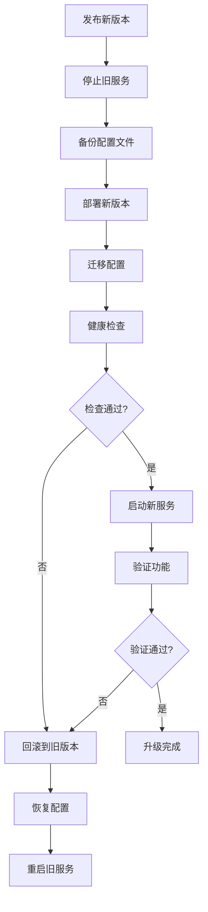

**数据库迁移**(如后续引入):

- 使用版本化迁移脚本
- 支持前向和后向迁移
- 迁移前自动备份

## 十二、测试策略

### 12.1 测试数据集设计

**测试样本分类**:

| 类别 | 样本数量 | 特征 | 测试目的 |
|------|---------|------|---------|
| 标准样本 | 300张 | 清晰,正面,标准光照 | 基准准确率测试 |
| 低质量样本 | 200张 | 模糊,噪点,低分辨率 | 鲁棒性测试 |
| 复杂布局样本 | 150张 | 多条码,密集文字 | 关联分析测试 |
| 倾斜样本 | 100张 | 不同角度拍摄 | 预处理能力测试 |
| 多语言样本 | 100张 | 包含中英文混合 | OCR能力测试 |
| 边界样本 | 150张 | 极端情况(全空白,全黑等) | 容错性测试 |
| 总计 | 1000张 | - | - |

### 12.2 测试场景

**功能测试场景**:

| 场景ID | 场景描述 | 验收标准 |
|--------|---------|---------|
| FT-001 | 单条码识别 | 准确识别条码内容和类型 |
| FT-002 | 多条码识别 | 识别所有条码,无遗漏 |
| FT-003 | 条码排序 | 按阅读顺序正确排列 |
| FT-004 | 文字识别 | 识别关键字段(P/N, QTY等) |
| FT-005 | 条码-文字关联 | 正确关联条码与相邻文字 |
| FT-006 | 批量处理 | 成功处理多张图像 |
| FT-007 | 模式切换 | 不同模式返回预期结果 |
| FT-008 | 本地OCR | 离线环境正常工作 |
| FT-009 | 云端OCR | 联网环境正确调用云端API |
| FT-010 | 结果导出 | 正确导出JSON/CSV格式 |

**性能测试场景**:

| 场景ID | 场景描述 | 性能目标 |
|--------|---------|---------|
| PT-001 | 极速模式单图 | < 30ms |
| PT-002 | 均衡模式单图 | < 150ms |
| PT-003 | 完整模式单图 | < 500ms |
| PT-004 | 批量100张 | < 15秒 |
| PT-005 | 并发10请求 | 响应时间不超过单请求2倍 |
| PT-006 | 大图处理(4000x3000) | < 1秒(预处理+识别) |

**压力测试场景**:

- 持续1小时每秒10请求
- 内存使用保持稳定
- 无内存泄漏
- 错误率 < 1%

### 12.3 验收标准

**准确率验收**:

| 指标 | 目标值 | 测试样本 | 计算方式 |
|------|-------|---------|---------|
| 条码识别准确率 | ≥ 99% | 标准样本 | 正确识别数 / 总条码数 |
| 条码识别召回率 | ≥ 98% | 标准样本 | 识别出的条码数 / 实际条码数 |
| 文字识别准确率 | ≥ 95% | 标准样本 | 正确字符数 / 总字符数 |
| 排序正确率 | ≥ 98% | 复杂布局样本 | 正确排序的样本数 / 总样本数 |
| 关联准确率 | ≥ 90% | 复杂布局样本 | 正确关联数 / 总关联数 |

**性能验收**:

所有性能测试场景必须在推荐配置环境下满足目标值。

**可用性验收**:

- 系统7×24小时可用率 ≥ 99%
- 单点故障恢复时间 < 5分钟
- 错误信息清晰易懂
- 文档完整,示例可运行

## 十三、风险评估与应对

### 13.1 技术风险

| 风险项 | 风险等级 | 影响 | 应对措施 |
|--------|---------|------|---------|
| OCR准确率不达标 | 中 | 文字识别功能不可用 | 1. 提供多种OCR引擎切换<br/>2. 支持云端增强<br/>3. 实施后处理校正算法 |
| 排序算法在复杂布局下失效 | 中 | 输出顺序混乱 | 1. 提供多种排序策略<br/>2. 支持手动调整<br/>3. 可视化辅助验证 |
| 性能不满足实时要求 | 高 | 用户体验差 | 1. 极速模式优化<br/>2. 异步处理机制<br/>3. GPU加速支持 |
| 特殊条码格式不支持 | 低 | 部分标签无法识别 | 1. 可扩展的解码器架构<br/>2. 定期更新条码库 |

### 13.2 运维风险

| 风险项 | 风险等级 | 影响 | 应对措施 |
|--------|---------|------|---------|
| Tesseract安装失败 | 中 | 本地OCR不可用 | 1. 提供Docker镜像<br/>2. 详细安装文档<br/>3. 自动检测并提示 |
| 云端API调用超限 | 中 | 额外成本或服务中断 | 1. 配置调用限额<br/>2. 自动降级到本地<br/>3. 成本监控告警 |
| 磁盘空间耗尽 | 低 | 临时文件堆积 | 1. 定时清理机制<br/>2. 磁盘监控告警<br/>3. 配置最大使用量 |
| 并发过载 | 中 | 服务拒绝或崩溃 | 1. 请求限流<br/>2. 队列缓冲<br/>3. 自动扩容(云部署) |

### 13.3 业务风险

| 风险项 | 风险等级 | 影响 | 应对措施 |
|--------|---------|------|---------|
| 用户数据泄露 | 高 | 法律和信誉损失 | 1. 严格的数据安全策略<br/>2. 本地模式默认不保存数据<br/>3. 安全审计 |
| 识别错误导致业务损失 | 高 | 用户信任度下降 | 1. 提供置信度评分<br/>2. 人工复核机制<br/>3. 明确免责声明 |
| 依赖的云服务停止服务 | 中 | 云端模式不可用 | 1. 支持多个云服务提供商<br/>2. 本地模式作为备份<br/>3. 平滑降级 |

### 13.4 风险监控指标

| 监控指标 | 告警阈值 | 处理动作 |
|---------|---------|---------|
| OCR失败率 | > 10% | 自动切换OCR引擎或降级 |
| 云端API错误率 | > 5% | 降级到本地模式 |
| 平均处理时间 | 超过目标值50% | 触发性能优化流程 |
| 系统错误率 | > 1% | 人工介入排查 |

## 十四、后续扩展规划

### 14.1 功能扩展方向

| 扩展功能 | 优先级 | 实现难度 | 预期价值 |
|---------|-------|---------|---------|
| 移动端App | 高 | 中 | 拓展使用场景,现场采集 |
| 批量导入模板配置 | 中 | 低 | 提升特定场景准确率 |
| 历史记录管理 | 中 | 低 | 数据追溯和统计分析 |
| 用户自定义字段解析规则 | 中 | 中 | 适应不同标签格式 |
| AI辅助的关联分析 | 低 | 高 | 提升复杂场景准确率 |
| 批量结果对比校验 | 低 | 中 | 质量控制 |

### 14.2 性能优化方向

- 引入模型推理加速(ONNX Runtime)
- 实现智能预加载和预测性缓存
- 支持分布式处理(多机协作)
- GPU加速的图像预处理

### 14.3 集成扩展方向

- 提供Webhook回调支持
- 支持消息队列集成(RabbitMQ/Kafka)
- 开发各语言SDK(Java/JavaScript/Go)
- 提供云服务SaaS版本

## 十五、交付物清单

### 15.1 软件交付物

| 交付物 | 内容 | 交付形式 |
|--------|------|---------|
| 后端服务 | Python应用代码,包含所有处理引擎 | 源代码 + Docker镜像 |
| 前端应用 | Web界面,包含所有交互页面 | 编译后的静态资源 |
| 部署脚本 | Docker Compose配置,启动脚本 | YAML + Shell脚本 |
| 配置文件 | 系统默认配置,配置模板 | YAML文件 |

### 15.2 文档交付物

| 文档类型 | 内容 | 目标读者 |
|---------|------|---------|
| 安装部署指南 | 环境准备,安装步骤,配置说明 | 运维人员 |
| 用户使用手册 | 功能介绍,操作步骤,常见问题 | 最终用户 |
| API参考文档 | 接口定义,参数说明,示例代码 | 集成开发人员 |
| 系统设计文档 | 架构设计,技术选型,设计决策 | 技术团队 |
| 测试报告 | 测试场景,测试结果,性能基准 | 项目管理人员 |

### 15.3 测试交付物

| 交付物 | 内容 |
|--------|------|
| 测试数据集 | 1000张分类标注的测试图像 |
| 测试用例集 | 功能测试、性能测试、压力测试用例 |
| 自动化测试脚本 | 单元测试、集成测试、端到端测试脚本 |
| 测试报告 | 测试执行结果,缺陷统计,性能基准 |

## 十六、项目里程碑

### 16.1 开发阶段划分

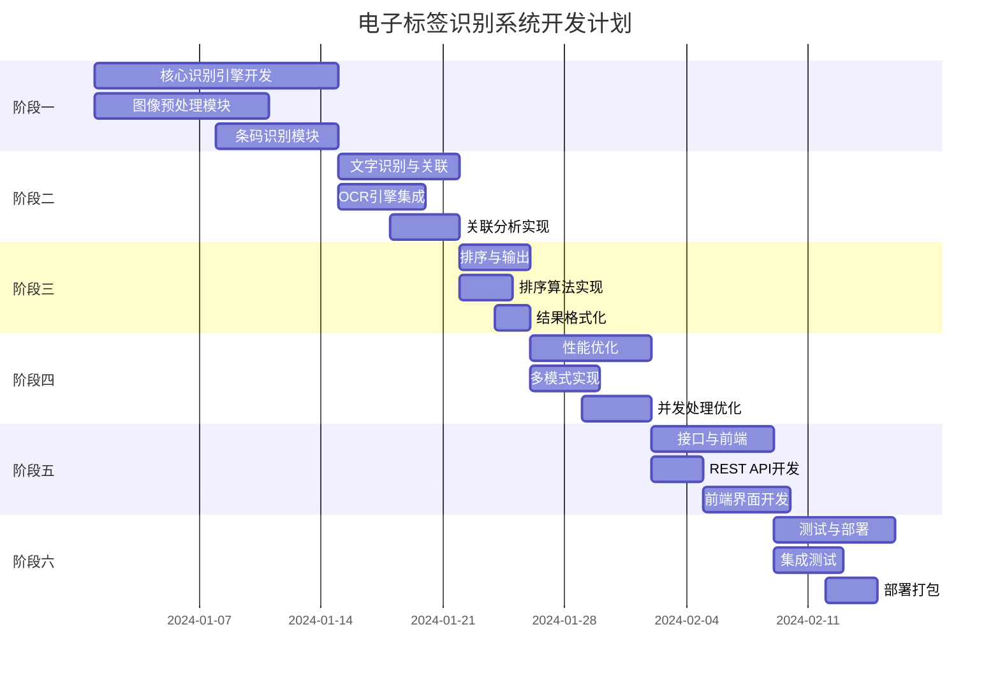

### 16.2 关键里程碑

| 里程碑 | 时间点 | 交付物 | 验收标准 |
|--------|-------|--------|---------|
| M1: 核心识别能力 | 第2周末 | 条码+文字识别引擎 | 单图识别准确率 > 95% |
| M2: 关联与排序 | 第3周末 | 关联分析+排序引擎 | 排序正确率 > 95% |
| M3: 性能达标 | 第5周末 | 优化后的处理引擎 | 均衡模式 < 150ms |
| M4: API完成 | 第6周末 | REST API + 前端 | 所有接口可用 |
| M5: 系统发布 | 第7周末 | 完整系统 | 通过所有验收测试 |

## 十七、成功标准

### 17.1 功能完整性

- ✅ 支持至少6种一维条码和3种二维条码格式
- ✅ 能够一次性识别图像中的多个条码
- ✅ 提供至少3种排序策略供用户选择
- ✅ 支持结构化字段(P/N, QTY等)的自动解析
- ✅ 条码与文字的关联分析功能可用
- ✅ 提供本地和云端两种OCR模式
- ✅ 支持单图和批量两种处理方式
- ✅ 提供完整的Web前端界面
- ✅ 支持JSON和CSV两种导出格式
- ✅ 提供可视化标注功能

### 17.2 性能达标

| 性能指标 | 目标值 | 验证方式 |
|---------|-------|---------|
| 极速模式响应时间 | < 30ms | 标准样本平均值 |
| 均衡模式响应时间 | < 150ms | 标准样本平均值 |
| 完整模式响应时间 | < 500ms | 标准样本平均值 |
| 批量处理效率 | 100张 < 15秒 | 批量测试 |
| 并发处理能力 | 支持10并发 | 压力测试 |
| 内存使用 | < 1GB | 100张批量处理 |

### 17.3 质量达标

| 质量指标 | 目标值 | 验证方式 |
|---------|-------|---------|
| 条码识别准确率 | ≥ 99% | 1000张测试集 |
| 文字识别准确率 | ≥ 95% | 标准样本 |
| 排序正确率 | ≥ 98% | 复杂布局样本 |
| 系统可用率 | ≥ 99% | 7天稳定性测试 |
| 错误率 | < 1% | 压力测试 |
| 代码覆盖率 | ≥ 80% | 单元测试 |

### 17.4 可用性达标

- ✅ 用户无需编程即可通过Web界面使用所有功能
- ✅ 系统提供清晰的错误提示和操作建议
- ✅ 文档齐全,包含安装、使用、API参考
- ✅ 提供至少5个典型场景的示例
- ✅ 支持Docker一键部署
- ✅ 配置文件结构清晰,易于修改

### 17.5 安全合规

- ✅ 本地模式下所有数据不离开本地服务器
- ✅ 云端模式需用户明确授权才能启用
- ✅ 敏感配置(API密钥)加密存储
- ✅ 支持HTTPS加密传输
- ✅ 临时文件处理后自动清理
- ✅ 通过基本的安全扫描(无高危漏洞)
